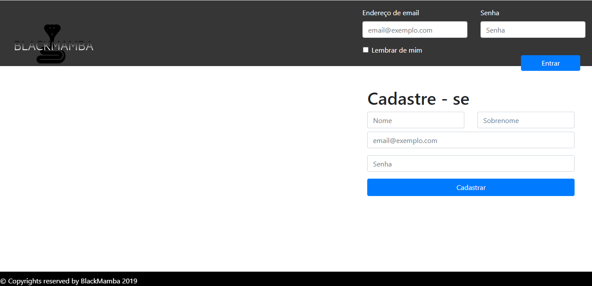
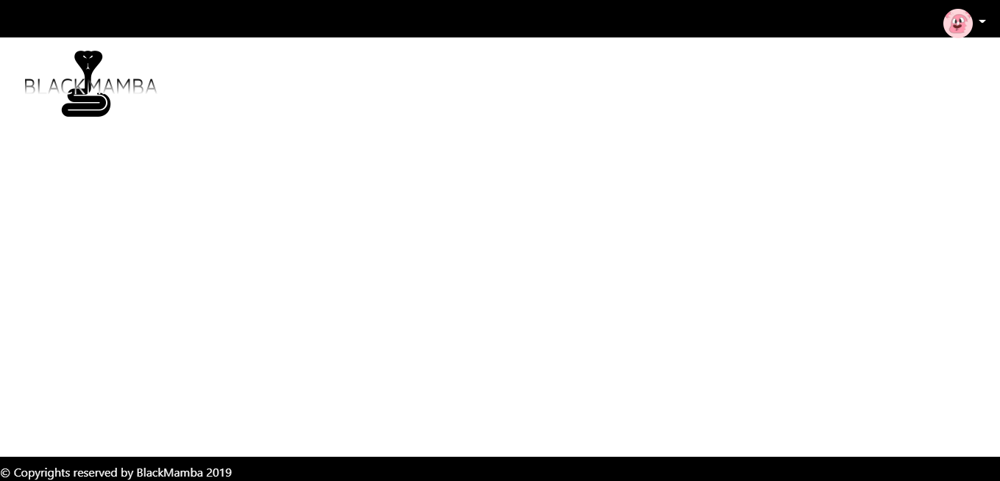

# webbot-blackmamba

### Resumo do Projeto
O projeto foi o desenvolvimento de um Web bot que envia através do telegram informações de ações da bolsa de valores de uma empresa escolhida pelo usuário. As informações incluem histórico da ação através de gráficos.

### Tecnologias adotadas na solução

A linguagem python foi escolhida como principal para o nosso projeto devido ter uma curva de aprendizado relativamente menor comparada as outras linguagens do mercado, além de possuir bibliotecas cruciais para a construção do projeto que incluem Beautiful Soup para raspagem de dados, Pandas para leitura e processamento dos dados, Matplotlib para gerar um gráfico, PyMySQL para auxiliar a conexão com o banco de dados, Selenium para realizar a navegação na web via webdriver do Google Chrome, Email para envio de emails e Telegram-bot para envio de mensagens no telegram. Para a construção do front end foi escolhido o framework do Python chamado Django, assim como HTML, CSS, JavaScript e Bootstrap que é uma coleção de estruturas visuais usando os três últimos itens citados anteriormente), posteriormente substituídos pelo PowerBI devido sua facilidade em implementar gráficos na web que desejávamos no projeto. Como armazenamento de dados foi escolhido o banco de dados MySQL.

* Python 3.7 - Linguagem principal;
* Zen of Python - boas práticas para o Projeto;
* PyCharm e/ou Visual Studio Code - IDE's;
* Django, Javascript, HTML5, CSS,  Bootstrap - Front End WEB;
* MySQL - Banco de Dados;
* Conceitos do SCRUM - Norteador do Projeto.
* PowerBI - Usado posteriormente para exibição dos dashboards. 
* Principais Bibliotecas Python:  
    **PyMySQL** - interação com nosso Banco de Dados;  
    **Selenium** - navegação pela Web através do WebDriver do Google Chrome;  
    **Beautiful Soup** - interação com o html dos sites para permitir as raspagens de dados;  
    **Pandas / Matplotlib** - ferramentas para gerar e plotar graficos;  
    **Email / Telegram-bot** - envio de alertas e notificações;

### Contribuições individuais/pessoais

Como contribuição individual, fui responsável por implementar as bibliotecas Pandas e Matplotlib ao projeto, além da construção do front end e integração ao Django que mais tarde foi alterado para o PowerBI devido sua facilidade para implementar gráficos na web e ferramentas fundamentais para manipulação de tais. Abaixo comentarei um pouco mais a respeito das bibliotecas e destacarei alguns códigos implementados ao projeto com anotações explicativas diretamente no mesmo.

* Bibliotecas do Python: Pandas e Matplotlib
> Esse código trata da importação da biblioteca Pandas para que seja feita a leitura do nosso arquivo .csv
##### text.py 
```python
import pandas as pd
# Realiza a leitura do arquivo csv     
dt = pd.read_csv('arq1.csv')

# Define que será feito a leitura das colunas do arquivo
dt.columns
# Exibe na tela a coluna selecionada
print(dt.valor_total)
```
> Esse código integra a biblioteca Pandas que está realizando a leitura do arquivo com a Matplotlib que está criando o gráfico para o usuário enviados via Telegram
##### graficos.py
```python
import pandas as pd
import matplotlib.pyplot as plt

# Realiza a leitura do arquivo csv
df = pd.read_csv('arq1.csv', sep=';')

# Usa a biblioteca Matplotlib para montar o gráfico e mostrar na tela para o usuário
plt.plot(df['Hora'], df['Valor_total'])
plt.show()
```

* Front-End
> Foi iniciado a montagem de um front end usando HTML, CSS e JS
##### index.html
```html
<!DOCTYPE html>
<html lang="pt-br">
  <head>
    <meta charset="UTF-8" />
    <meta http-equiv="X-UA-Compatible" content="ie=edge" />
    <title>MB Bot</title>
    <meta
      name="viewport"
      content="width=device-width, initial-scale=1,  shrink-to-fit=no"
    />
    <link
      rel="stylesheet"
      href="https://use.fontawesome.com/releases/v5.8.1/css/all.css"
      integrity="sha384-50oBUHEmvpQ+1lW4y57PTFmhCaXp0ML5d60M1M7uH2+nqUivzIebhndOJK28anvf"
      crossorigin="anonymous"
    />
    <link
      href="https://fonts.googleapis.com/css?family=Dosis&display=swap"
      rel="stylesheet"
    />
    <link rel="stylesheet" href="../css/bootstrap.min.css" type="text/css" />
    <link rel="stylesheet" type="text/css" media="screen" href="style.css" />
  </head>
  <body>
    <div
      class="fixed-top banner"
      style="height: 23%; background-color: rgb(54, 54, 54);"
    >
      
      <div
        class="card p-3 bg-transparent float-right text-white border-0"
        style="width: 40%;"
      >
        <form class="row">
          <div class="form-group col-sm-6">
            <label for="exampleDropdownFormEmail2">Endereço de email</label>
            <input
              type="email"
              class="form-control"
              id="exampleDropdownFormEmail2"
              placeholder="email@exemplo.com"
            />
          </div>
          <div class="form-group col-sm-6">
            <label for="exampleDropdownFormPassword2">Senha</label>
            <input
              type="password"
              class="form-control"
              id="exampleDropdownFormPassword2"
              placeholder="Senha"
            />
          </div>
          <div class="form-check ml-3">
            <input
              type="checkbox"
              class="form-check-input"
              id="dropdownCheck2"
            />
            <label class="form-check-label" for="dropdownCheck2">
              Lembrar de mim
            </label>
          </div>
          <button
            type="submit"
            class="btn btn-primary float-right bg-primary col-sm-3"
            style="margin-left: 70%"
          >
            Entrar
          </button>
        </form>
      </div>
      <div class="card bg-transparent border-0 align-right">
        <form>
          <h1>Cadastre - se</h1>
          <div class="row">
            <div class="col">
              <input type="text" class="form-control" placeholder="Nome" />
            </div>
            <div class="col">
              <input type="text" class="form-control" placeholder="Sobrenome" />
            </div>
          </div>
          <div class="form-group mt-2">
            <input
              type="email"
              class="form-control"
              id="exampleDropdownFormEmail2"
              placeholder="email@exemplo.com"
            />
          </div>
          <div class="form-group">
            <input
              type="password"
              class="form-control"
              id="exampleDropdownFormPassword2"
              placeholder="Senha"
            />
          </div>
          <div>
            <a
              role="button"
              class="btn btn-primary bg-primary p-2"
              href="cadastro.html"
              style="width: 100%;"
            >
              Cadastrar
            </a>
          </div>
        </form>
      </div>
    </div>
    <div class="fixed-bottom banner" style="height: 5%;">
      <span class="text-white fixed-bottom"
        >&copy Copyrights reserved by BlackMamba 2019</span
      >
    </div>
    <script src="../js/jquery-3.4.1.min.js"></script>
    <script src="../js/popper.min.js"></script>
    <script src="../js/bootstrap.min.js"></script>
    <script src="../js/main.js"></script>
  </body>
</html>
```


##### dashboard
```html
<!DOCTYPE html>
<html lang="pt-br">
  <head>
    <meta charset="UTF-8" />
    <meta http-equiv="X-UA-Compatible" content="ie=edge" />
    <title>MB Bot</title>
    <meta
      name="viewport"
      content="width=device-width, initial-scale=1,  shrink-to-fit=no"
    />
    <link
      rel="stylesheet"
      href="https://use.fontawesome.com/releases/v5.8.1/css/all.css"
      integrity="sha384-50oBUHEmvpQ+1lW4y57PTFmhCaXp0ML5d60M1M7uH2+nqUivzIebhndOJK28anvf"
      crossorigin="anonymous"
    />
    <link
      href="https://fonts.googleapis.com/css?family=Dosis&display=swap"
      rel="stylesheet"
    />
    <link rel="stylesheet" href="../css/bootstrap.min.css" type="text/css" />
    <link rel="stylesheet" type="text/css" media="screen" href="style.css" />
  </head>
  <body>
    <div class="fixed-top banner">
      <div>
        
        <div class="btn-group float-right mt-2 mr-2">
          <button
            type="button"
            class="btn btn-secondary dropdown-toggle"
            data-toggle="dropdown"
            aria-haspopup="true"
            aria-expanded="false"
          >
            
          </button>
          <div class="dropdown-menu dropdown-menu-right">
            <button class="dropdown-item" type="button">Configuração</button>
            <button class="dropdown-item" type="button">Sair</button>
          </div>
        </div>
      </div>
    </div>
    <div class="fixed-bottom banner" style="height: 5%;">
      <span class="text-white fixed-bottom"
        >&copy Copyrights reserved by BlackMamba 2019</span
      >
    </div>
    <script src="../js/jquery-3.4.1.min.js"></script>
    <script src="../js/popper.min.js"></script>
    <script src="../js/bootstrap.min.js"></script>
    <script src="../js/main.js"></script>
  </body>
</html>
```


> Outras páginas foram adicionadas mas somente com o template pois decidimos seguir o projeto usando PowerBI e abandonar os dashboards em HTML, CSS e JavaScript.

### Aprendizados Efetivos

Não tinha tido muito contato com programação anteriormente, então eu aprendi bastante. Como resultado consigo iniciar um projeto em Python, incluir bibliotecas, utilizar o Django, integrando templates HTML, CSS e JavaScript. Pude melhorar minhas habilidades na criação de interface web. Aprendi como enviar email e usar o bot do telegram. Nesse projeto nosso Scrum Master e Product Owner eram alunos do sexto semestre, nós fomos conduzidos por eles aos conceitos de Scrum e PO onde realizavamos atividades semanais, além de reuniões diarias para discutir o andamento do projeto.

OBS.: Eu entrei no projeto depois de 3 semanas que havia iniciado pois estava na lista de espera da Fatec e com desistencia fui chamada.
